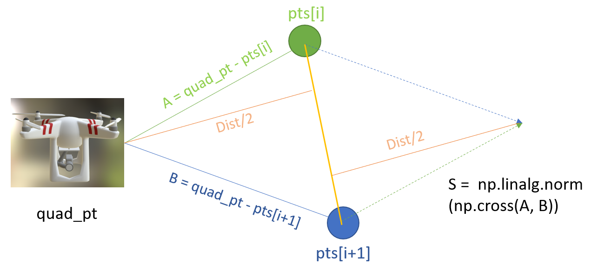

# DroneSim
### Reinforcement learning for path following of an AirSim quadrotor implemented in Unity city environment
### Drone in training:
|      |         |           |
| -----------                               | -----------                                  | ---------                                        |
| *Figure1. training started*    | *Figure2. 4,000 time steps*    |*Figure3. 12,000 time steps*   |
## Getting Started
- ### Download the [Unity package](https://github.com/RealBrandonChen/DroneSim/releases/download/unity/Path_following_quadrotor.unitypackage) containing the customized city environment and the AirSim drone;
- ### Add the python files in Path_Following to the AirSim/PythonClient/reinforcement_learning you've cloned;
- ### You can
  - ### Directly load the [pre-trainined model](https://github.com/RealBrandonChen/DroneSim/releases/download/unity/path_following_model.zip) by hitting `python Model_Load.py` in the terminal, and you'll see the drone following the city road
  - ### Train your own model by `python dqn_drone.py`, your trained model is saved as "best_model.zip"
## Implementation Explanation
### Code snippet credit to AirSim/PythonClient/Reinforcement_learning/drone_env, and the reward function is as following:
```python
def _compute_reward(self):
    thresh_dist = 7
    beta = 1
    x = -240
    y = 10
    z = 200
    pts = [
        np.array([x, y, z]),
        np.array([-350, y, z]),
        np.array([-350, y, 150]),
        np.array([-350, y, z-100]),
        np.array([-350, y, z-200]),
    ]
    ...
    ...
    if self.state["collision"]:
        reward = -100
    else:
        dist = 10000000
        for i in range(0, len(pts) - 1):
            dist = min(
                dist,
                np.linalg.norm(np.cross((quad_pt - pts[i]), (quad_pt - pts[i + 1])))
                / np.linalg.norm(pts[i] - pts[i + 1]),
            )

        if dist > thresh_dist:
            reward = -10
    ...
    ...
    done = 0
    if reward <= -10:
        done = 1

    return reward, done
```
The tuple of the coordinates represents the central line of the city road. The `dist` in the reward function computes the twice distance between the realtime drone and the central line comprised by the points. The distance computing is reperesented as following picture:
###

## Future Work
- ### Generate images data with imitation learning
  A trained policy by cross-modal representations has been achieved by [Rogerio Bonatti](https://github.com/microsoft/AirSim-Drone-Racing-VAE-Imitation). The imitation learning data is generated for passing through the drone racing obstacles. The path following task should also work applied with the generated imitation learning data.
- ### Implement the trained model in the real drone
  Transfer the simulation algorithm to real-world platform.
